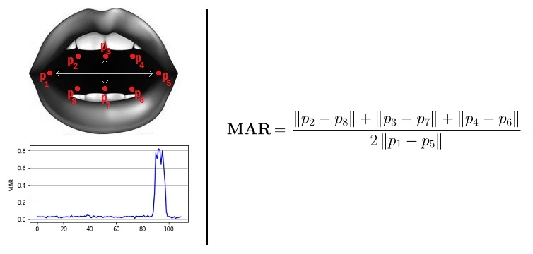

# Dont Sleep

   ## **PROBLEM STATEMENT**
   In India, there are a lot of accidents taking place every day due to mishaps. The no. of cars and accidents are increased as    the population grows. Most of the accidents take place due to people  feeling sleepy,high speed,drunk and drive.
   So,we are going to implement an accident prevention system which deals with the problem of accidents happening due to people    getting dozed off or feeling sleepy. 
   
   ## **APPLICATIONS**
This can be used by riders who tend to drive for a longer period of time that may lead to accidents

   
   ## **IDEA**
   A system that can automatically detect driver drowsiness in a real time video stream and shows an alert message if the driver appears to be drowsy.
  
   
   ## **WORKING**
   Program shows how to find frontal human faces in an image and estimate their pose. 
   The pose takes the form of 68 landmarks.These are points on the face such as the corners of the mouth, on the eyes, and so forth.
      
   
   
  - When Either no face is detected or the calculated aspect ratio is less than or equal to the threshold value, Alert message would be       displayed.
  
  - When Mouth Aspect Ratio is greater than Mouth Threshold Value, Notification for ‘Yawning’ would be displayed.
  
  - When Eyes Aspect Ratio is greater than Eyes Threshold Value, Notification for ‘Sleeping’ would be displayed. 
  
  - When Eyes Aspect Ratio and Mouth Aspect Ratio are greater than Eyes Threshold Value and Mouth Threshold Value respectively,    Notifications for ‘Sleeping and Yawning’ would be displayed.
   
   ## **RELATIONSHIP**
   You can compute **"Eye Aspect Ratio"(EAR)** using the formula given in research paper specified in references-
   
   
   
  You can compute **"Mouth Aspect Ratio"(MAR)** using the formula-
  
  
  
  ## **Algorithm Models**
 
 **K-nearest neighbors**
 
 K-NN is a non-parametric and lazy learning algorithm.  Non-parametric means there isno assumption for underlying data distribution i.e.  the model structure determined fromthe dataset.  It is called Lazy algorithm because it does not need any training data pointsfor model generation.  All training data is used in the testing phase which makes trainingfaster and testing phase slower and costlier.  In K-NN classification, the output is a classmembership.  An object is classified by a plurality vote of its neighbors, with the objectbeing assigned to the class most common among its k nearest neighbors (k is a positiveinteger, typically small).  To determine which of the K instances in the training dataset aremost similar to a new input, a distance measure is used.  For real-valued input variables,the most popular distance measure is the Euclidean distance.
  
 
  
**Naive bayes**

A Naive Bayes classifier is a probabilistic machine learning model that is used for classi-fication task.  The crux of the classifier is based on the Bayes theorem.  It is a generativeclassifier where features are often assumed to be of Gaussian distribution and also sta-tistically independent from one another.This assumption is usually false.  That’s why it’susually known as a naive Bayes classifier.  The Naive Bayes Classifier can produce veryaccurate classification results with a minimum training time when compared to conven-tional supervised or unsupervised learning algorithms.
   
 
   
**Random Forest Regression**

Random Forest is a supervised learning algorithm.It creates a forest and makes it some-how random.The forest“ it builds, is an ensemble of Decision Trees.Random Forest adds additional randomness to the model, while growing the trees. Instead of searching for the most important feature while splitting a node, it searches for the best feature among a random subset of features. This results in a wide diversity that generally results in a better model.

**Support Vector Machine**

Support  vector  machines  are  supervised  learning  models  with  associated  learning  algo-rithms that analyze data used for classification and regression analysis.  SVM or SupportVector Machine is a linear model for classification and regression problems.  It can solvelinear and non-linear problems and work well for many practical problems.  The idea ofSVM is simple:  The algorithm creates a line or a hyperplane which separates the datainto classes.  Degree of confidence measure the probability of misclassification. 

**Comparison of Implemented Algorithms**

The following table shows maximum accuracy values corresponding to each algorithm-

|ALGORITHMS           | MAXIMUM ACCURACY |
| ---------------------| ---------------- |
| K-nearest neighbours |0.939392          |          
|Naive Bayes           |0.802693          |
|Random Forest         |0.85124           |
|Support Vector Machine|0.380883           |
   
   ## **DATASET**
   We have taken the human face images from the various source available on the internet to extract the features.  We have calculated the eye-aspect-ratio and mouth-aspect-ratio ofthose images by using the formula presented in the research paper and code in python([AspectRatio and label Prediction](src/landmarks_detection.py)).
   
   Output of above python code is displayed in the form of video made by us-**[VideoShowingEAR,MAR&Label](https://youtu.be/v0tKtYA7Bi4)**
   
   The dataset contains 248 facial images and their aspect ratios with the labels.
   
   Link of dataset-
   [Facial Landmarks](https://github.com/srss-BIProject/Alertness_detection/blob/master/facial_image_ar.csv)
  
 
  
  ##  **REFERENCES**
  - [Shape Predictor 68 Face Landmarks](http://dlib.net/face_landmark_detection.py.html)
  
  
  - [Facial Landmarks with dlib,opencv and python](https://www.pyimagesearch.com/2017/04/03/facial-landmarks-dlib-opencv-python/)
  
   - [Drowsiness-detection](https://www.pyimagesearch.com/2017/05/08/drowsiness-detection-opencv/)
   
   - [Research Paper](https://vision.fe.uni-lj.si/cvww2016/proceedings/papers/05.pdf)
   
 
   

----------------------------------------------
   
