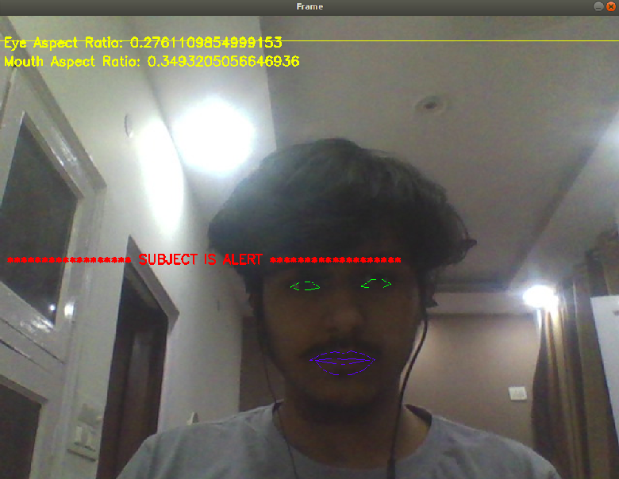
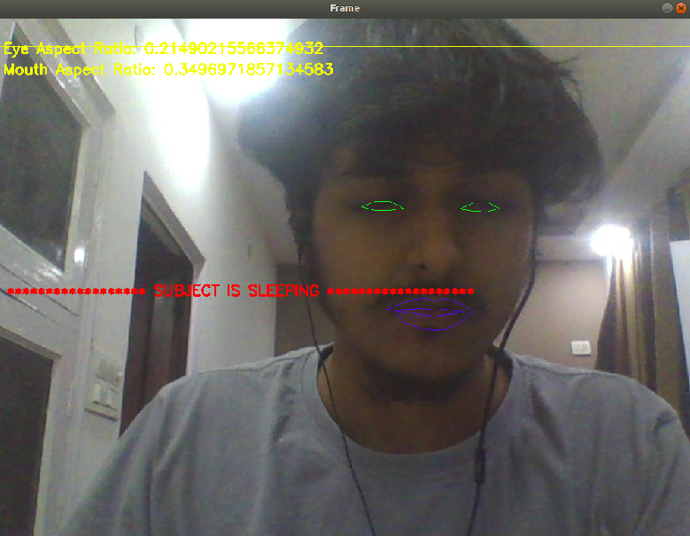

# Dont Sleep

   ## **PROBLEM STATEMENT**
   In India, there are a lot of accidents taking place every day due to mishaps. The no. of cars and accidents are increased as    the population grows. Most of the accidents take place due to people  feeling sleepy,high speed,drunk and drive.
   So,we are going to implement an accident prevention system which deals with the problem of accidents happening due to people    getting dozed off or feeling sleepy. 
   ## **Results**
   ```Alert subject detection :``` <br/>
   <br/>
   
   <br/>
   <br/>
   ``` Sleeping Subject Detection```
   <br/>
   <br/>
    
   <br/>
   <br/>
   ``` Yawning Subject Detection``` 
   <br/>
   <br/>
    
   <br/>
   <br/>
   ## **APPLICATIONS**
This can be used by riders who tend to drive for a longer period of time that may lead to accidents

   
   ## **IDEA**
   A system that can automatically detect driver drowsiness in a real time video stream and shows an alert message if the driver appears to be drowsy.
  
   
   
